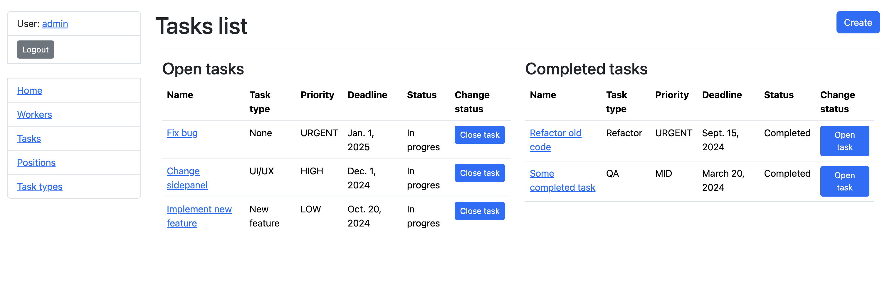

# Task manager
Django project for managing tasks for IT companies. Using this simple app you can create tasks, add your employees, assign deadlines and priorities to tasks, assign those task to your employees, mark tasks as open/closed.

## Technologies
* Python
* Django
* DjangoORM
* SQLite
* HTML/CSS
* Bootstrap

## Check it out!
TODO: add deployed project

## Installation
Python3 must be already installed

```shell
git clone https://github.com/AlexRozv/task-manager.git #downloads project on yor device
cd task_manager #moves to project directory
python3 -m venv venv #creates virtual environment
#MacOs
source venv/bin/activate #activates virtual environment
#Windows
source venv\Scripts\activate #activates virtual environment
pip install -r requirements.txt #installing required modules
python manage.py migrate #creates local DB using migrations
python manage.py runserver #starts Django server
```

## Features
* Authentication functionalities for Worker/User
* CRUD operations for all the models (Worker, Task, TaskType, Position)
* Ability to work with db through admin panel
* Assigning tasks to workers
* Marking tasks as open/closed
* Tasks automatically move to open/closed list when marked accordingly
* Open/closed task lists for each worker

## Demo
